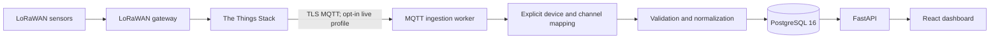

# Rain Garden Environmental Monitoring Dashboard

This repository contains the software prototype developed for an MSc Data Science dissertation: an
end-to-end LoRaWAN environmental monitoring platform for urban Sustainable Drainage Systems (SuDS).
It receives reviewed sensor uplinks, stores normalized observations with provenance, and provides
operational and historical views through a browser dashboard.

The prototype was developed and evaluated in a local Docker environment. It was not deployed as a
continuous production service and did not conduct a hydrological evaluation of Orchard Park.

## System architecture



The MQTT client is a transport adapter. Device mapping, validation, raw-event preservation,
normalization, quarantine, idempotency, and persistence are handled by shared ingestion and
repository layers. Public API responses expose selected normalized fields rather than private raw
uplinks or network identifiers. See [the architecture document](docs/architecture.md) for the
detailed component and data-model design.

## Main functions

- **Overview** — device availability, latest observations, data-quality flags, and the approved
  Orchard Park reference map.
- **Devices** — searchable and filterable device inventory with operational status and last receipt.
- **Device Detail** — latest channel values, selectable 24-hour, 7-day, 30-day, or custom historical
  ranges, bounded chart rendering, and complete normalized CSV export for one selected channel.
- **Explore** — site-wide historical comparison by metric group and channel, with unit-separated
  charts, period summaries, and schedule-aware coverage where reporting metadata is known.
- **API** — versioned FastAPI endpoints, generated OpenAPI types, bounded historical retrieval, and
  privacy-reviewed export fields.

Historical queries use half-open UTC windows `[start, end)`. Human-facing timestamps are displayed
in `Europe/London`; exported timestamps remain explicit UTC values. Missing observations are never
converted to numeric zero.

## Data and privacy boundaries

Live observations enter through the profile-gated TTN MQTT worker using explicitly reviewed device
and measurement mappings. Valid TTN credentials are private and are not included in the repository.
Redacted fixtures and deterministic sample data remain only for automated testing and safe local
development; they are not Orchard Park field observations or the dissertation's primary evaluation
dataset.

Only units established by reviewed device-and-measurement-ID metadata are marked confirmed. Other
channels retain pending unit metadata, and the dashboard does not infer calibration, reporting
cadence, or hydrological meaning from numeric values.

## Repository structure

```text
backend/              FastAPI, SQLAlchemy models, migrations, ingestion, analytics, and tests
frontend/             React/Vite dashboard, generated API types, Vitest, and Playwright tests
db/init/              PostgreSQL application-role initialization
docs/                 Architecture, requirements, assumptions, security, and operating guides
sample-data/          Synthetic-data manifest and payload documentation
scripts/              Contract, privacy, portability, and fixture-maintenance checks
docker-compose.yml    Local PostgreSQL, backend, frontend, and opt-in MQTT worker
.env.example          Placeholder-only local configuration template
```

## Run locally with Docker

### Prerequisites

- Docker Desktop or another Docker Engine with Compose v2
- A current web browser

Host Python and Node.js are needed only for contributor checks.

1. Create the ignored local environment file and replace every placeholder with an appropriate local
   value. Do not commit this file.

   ```bash
   cp .env.example .env
   ```

2. Build the images, start PostgreSQL, and apply all migrations. To inspect the interface without
   private TTN credentials, load the deterministic development sample data; it is not field or
   dissertation-evaluation data.

   ```bash
   docker compose build
   docker compose up -d db
   docker compose run --rm backend uv run alembic upgrade head
   docker compose run --rm backend uv run python -m app.db.seed
   ```

3. Start the API and dashboard.

   ```bash
   docker compose up -d backend frontend
   docker compose ps
   ```

Open:

- Dashboard: <http://localhost:5173>
- API health: <http://localhost:8000/api/v1/health>
- Interactive API documentation: <http://localhost:8000/docs>

Both catalog and demonstration seeds are deterministic and idempotent. Do not reset an existing
database that may contain monitoring data. PostgreSQL uses the named `postgres-data` volume, which
survives ordinary container and Compose restarts when volumes are not explicitly removed.

## Live TTN ingestion

Live ingestion uses The Things Stack and TLS MQTT and is intentionally excluded from normal Compose
startup. It requires the reviewed inventory and valid private TTN credentials stored only in the
ignored repository-root `.env`; those credentials are not committed.

On a clean, migrated, inventory-only database, load the approved proxy catalogue and start the
profile-gated worker:

```bash
docker compose run --rm backend uv run python -m app.db.seed_ttn_proxy
docker compose --profile live up --build -d ttn-mqtt-worker
```

Stop only the worker with:

```bash
docker compose --profile live stop ttn-mqtt-worker
```

The worker remains opt-in and does not change TTN Console, payload formatters, downlinks, or external
webhooks. See [the live MQTT guide](docs/live-ttn-mqtt.md) for configuration and safety constraints.

## Offline replay

The private full TTN export and decoder are intentionally ignored. Automated tests use only redacted
derivatives. A developer who is authorized to hold the private fixture can follow
[the offline replay guide](docs/offline-ttn-replay.md); replay does not contact TTN or alter TTN
configuration.

## Verification

The committed lockfiles are authoritative. The principal local checks are:

```bash
# Repository / Compose
docker compose config --quiet
python3 scripts/check_portability.py
python3 scripts/check_public_privacy.py

# Backend (from backend/)
uv sync --frozen
uv run ruff format --check .
uv run ruff check .
uv run mypy .
uv run pytest --cov=app --cov-branch --cov-report=term-missing
uv run alembic check

# Frontend (from frontend/)
npm ci
npm run format:check
npm run lint
npm run typecheck
npm run test:run
npm run build
npm run check:api
npm run test:e2e
```

Database-writing tests and migration checks should use an isolated disposable test database, never a
live monitoring database. GitHub Actions repeats the static, test, migration, contract, browser,
dependency-audit, and secret-scanning gates. The complete policy is in
[docs/change-protocol.md](docs/change-protocol.md).

## Deployment scope and known limitations

- The system was evaluated locally with Docker Compose; no continuously hosted production deployment
  was implemented. Monitoring and MQTT ingestion stop when the host sleeps or shuts down.
- No user authentication, automated backup service, retention policy, cloud deployment, TTN Storage
  API backfill, downlink workflow, live webhook adapter, or alert engine is included.
- Reporting schedules, calibration, and several proxy measurement meanings or units remain
  unconfirmed; coverage is unavailable instead of inferred when required schedule metadata is absent.
- The Orchard Park map is an approved static reference dataset and is not linked to the live proxy
  devices or their observations.
- Software licensing remains unresolved pending university and partner confirmation; no licence file
  is included.

## Dissertation

This repository accompanies an MSc Data Science dissertation and provides the inspectable software
artefact, automated tests, architecture records, and reproducible local runtime used in the project.
The dissertation and accompanying screen recording provide evidence of the implemented platform and
dashboard operation. The planned long-term Orchard Park field deployment was not completed within
the dissertation timeframe, and the artefact was evaluated as a local, containerised prototype.
