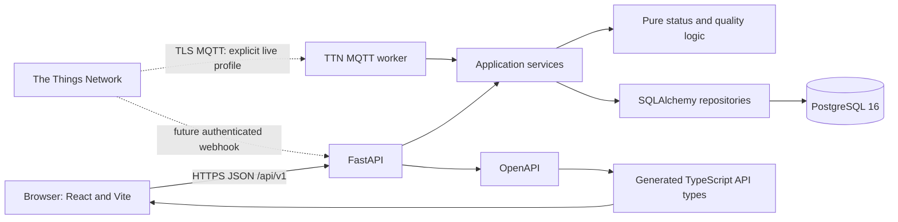

# Architecture

## Context

The browser reads normalized, public sensor data from a versioned FastAPI service. FastAPI coordinates services, pure quality/status functions, and SQLAlchemy repositories. PostgreSQL stores the original private uplink separately from long-format measurements. A future TTN webhook crosses a server-to-server trust boundary but remains disabled. A local offline file replay exercises one fixture-driven TTN ApplicationUp normaliser without crossing that network boundary.

## Components and dependency direction

- Frontend pages compose features and present view models.
- Curated Orchard Park reference locations are held in one frontend metadata module for the
  Overview map. They are not inferred from, or associated with, live proxy devices.
- The typed client is generated from OpenAPI and is the only browser network boundary.
- TanStack Query owns server-state fetching and caching.
- Recharts receives already prepared numeric series; it performs no scientific calculations.
- API endpoints validate transport input and call services.
- Services define use cases and calculation reference times.
- Repositories contain persistence and bounded query logic.
- `analytics` and status modules contain pure, independently tested functions.

Required dependency direction is `API -> services -> domain/repositories`. Repositories and domain code never depend on API routes. Backend and frontend source trees never import each other.

## Data flow

1. A canonical internal uplink is validated independently of TTN-specific fields.
2. The ingestion service obtains idempotency through unique `(source, idempotency_key)` storage.
3. The private raw JSONB event is stored once.
4. Measurements reference both the event and a `SensorChannel` carrying separate metric, nullable unit, unit-confirmation, installation-depth, position, and schedule metadata.
5. Successfully decoded, mapped, finite numeric observations are valid measurements; pending
   scientific meaning, units, calibration, and timestamp interpretation remain separate channel
   metadata and do not create quality warnings.
6. Public repositories select normalized fields only.
7. Services apply explicit reference times, quality exclusions, comparability rules, and freshness thresholds.
8. Pydantic response schemas exclude private coordinates, external identifiers, and raw payloads.

The offline TTN path adds a file adapter before step 1. It selects only `as.up.data.forward`, then
passes `event.data` to an ApplicationUp normaliser that has no file, network, or database dependency.
Known `outflow-a` events reuse `UplinkEvent` and `Measurement`; unmappable or structurally unsafe
selected events go to private `TTNReplayQuarantine`. This separation permits future reuse but does
not enable the existing webhook or create a live connection.

The separately started MQTT path adds a thin transport adapter before the same ApplicationUp
normaliser. A dedicated worker container is excluded from normal Compose startup by the `live`
profile and subscribes to application-wide uplinks. Its composition root injects a shared ingestion service
into the MQTT adapter; the MQTT module has no database, model, or repository dependency. TLS,
credential loading, bounded reconnect, malformed-message containment, and clean shutdown remain in
the transport layer. Bounded JSON decoding, payload normalisation, device mapping, validation,
raw preservation, quarantine, idempotency, and one database transaction per message are owned by
the transport-independent service and repository layers. An explicit eight-device allowlist selects
one evidence-backed mapping or quarantines the event; it never infers a mapping from an unknown
payload. A future authenticated webhook can call
the same service without changing storage or public consumers. The API key is read only from the
ignored local environment and is never part of the FastAPI process.

## Data model

- **Site:** UUID, name, description, public location label, disclosure classification, nullable private latitude/longitude, IANA display timezone, active flag, audit timestamps.
- **MonitoringFeature:** UUID, site FK, controlled feature type, public slug/name, active flag, audit timestamps. A site can contain multiple Swales, tree pits, or future approved feature types without encoding the relationship in presentation text.
- **Device:** UUID, site and monitoring-feature FKs, private external ID, display name, controlled device/configuration types, nullable operational override, nullable private latitude/longitude, disclosure classification, last-seen time, audit timestamps.
- **SensorChannel:** UUID, device FK, unique channel code per device, metric FK, nullable physical-unit FK, controlled unit-confirmation status, nullable installation depth/position, nullable expected interval/schedule anchor/jitter tolerance/water datum, active flag, private metadata JSONB, audit timestamps. The public `installation_depth_cm` field retains `depth_cm` as a Phase 1 compatibility alias.
- **MetricDefinition:** unit-neutral metric code, controlled Explorer group, and reader metadata synchronized from `backend/app/metric_catalog.py`.
- **UnitDefinition:** physical-unit code, name, symbol, and meaning synchronized separately from the same catalogue.
- **UplinkEvent:** UUID, device FK, source/idempotency identity, event timestamps, optional frame counter/schema version, private raw JSONB, ingestion status/error, audit timestamp.
- **Measurement:** UUID, uplink/device/channel FKs, numeric value, measured time, quality flag/notes, audit timestamp.
- **DeviceTelemetry:** Latest replay-derived operational status and radio context, kept separate from
  scientific channels; exact gateway identity remains private and only an allowlisted alias is public.
- **TTNReplayQuarantine:** Private raw selected events that cannot be parsed or mapped safely,
  deduplicated by a deterministic content identity and never exposed by public routes.

Installation depth and position never alter the controlled metric code. Channels at different confirmed depths would both use `soil_moisture` and remain separately identifiable. No tree-pit depths or depth channel count are currently configured.

`unit_confirmation_status` is independent of `unit_code`: pending channels may have no unit, while
deterministic demonstration channels use documented demo-normalised units with
`synthetic_demo_only`. A real TTN observation may be retained as a valid numeric observation when
its device/channel structure is explicitly mapped. Its physical unit is marked `confirmed` only
where supplied device-and-measurement-ID metadata establishes that mapping; unresolved channels
remain `pending`. The UI labels pending states as `Metadata pending` and `Unit unverified`; it does
not infer units from values or device names. The same separation applies to schedule metadata: coverage is
unavailable unless interval and anchor are explicitly configured.

Device list and detail responses expose `unit_confirmation_summary` as a read-time derivative of
stored `unit_confirmation_status` values on active channels only. A single distinct channel status
is preserved, multiple statuses become `mixed`, and no active channels becomes
`no_active_channels`. Device type, measurement labels or values, payload fields, and browser logic
never participate in this summary.

## Time Explorer and coverage

`GET /api/v1/explore` is a bounded, read-only site query. The endpoint validates a maximum 31-day
half-open UTC window and delegates to a service that joins public device/channel records with pure
coverage and summary calculations. Coverage and summaries use every matching observation. Each
channel's visualization points independently reuse the canonical configurable time-bucket min/max
selector: smaller series are unchanged, while larger series preserve real first, last, minimum, and
maximum observations without mixing devices or channels. Response-level counts are sums of explicit
per-series total/displayed metadata. Browser URLs retain `start`, `end`, feature, metric group, and
explicit channel selection so the same analytical view can be shared or carried between Explore and
Devices. The Overview quality-flag card reuses the KPI's site-wide quality window and the existing
bounded quality-flag source without inheriting Explore filter state.

The scientific time axis is `measured_at`; `received_at` is returned separately for transmission-delay assessment. Expected observations are schedule-aligned slots inside `[start, end)`, calculated from the channel's explicit expected interval and schedule anchor—not from rounded window duration. A configurable jitter tolerance assigns at most one accepted observation to a slot. Duplicate-slot observations do not increase received count; flagged observations are received but not valid; out-of-tolerance and late observations retain explicit timing labels; absent slots remain missing rather than zero. “Late” means reception occurred more than one expected reporting interval after `measured_at`; it does not reuse timestamp-jitter tolerance. If interval, anchor, or tolerance is absent, precise coverage is unavailable.

Period summaries are metric-specific and use valid observations. Wind direction has no arithmetic mean. Rainfall-intensity duration above zero is emitted only when cadence is known and every expected slot has a valid, in-tolerance observation. The frontend receives channel-specific series, groups only matching metric/unit/provenance combinations, renders incompatible units in separate synchronized small-multiple panels, and displays current freshness separately from historical coverage.

## Freshness and operational state

Device connectivity status is calculated, never stored as unquestioned truth:

- `unknown`: no `last_seen_at`.
- `online`: age is no greater than the configured stale threshold.
- `stale`: age is above the stale threshold and no greater than the offline threshold.
- `offline`: age is above the offline threshold.

Phase 1 demo defaults are 90 and 180 minutes. They are operational presentation settings based on the one-hour synthetic generator, not scientific or manufacturer thresholds. The response includes thresholds, age, reference time, and status basis. In demo mode, the reference time is the maximum dataset receipt time, not wall-clock time. Maintenance/disabled overrides are stored and reported separately.

Live proxy devices use current UTC time for freshness. Offline replay reports
`replay_dataset_reference_time`. Orchard Park keeps its own site-scoped synthetic reference, so
proxy events cannot change Orchard device status. When the proxy inventory exists, normal list and
default-site queries select it and omit synthetic sites; explicit demo/test databases remain
available through their separate seed workflow.

## API and privacy boundaries

Public endpoints return public IDs, monitoring-feature labels, calculated freshness, normalized measurements, and channel metadata needed for interpretation. Device inventory presentation keeps ingestion source, operational freshness, configuration completeness, and unit interpretation as separate fields. They never return raw uplinks, external device IDs, DevEUIs, private channel metadata, or exact coordinates. Confirmed device coordinates remain private API fields. The separately approved Orchard Park Overview map publishes only its eight confirmed reference locations from curated frontend metadata, without device IDs, TTN identifiers, live values, or deployment state; any API-based exact-coordinate access would still require a separately approved authenticated endpoint.

Device Detail resolves bounded half-open UTC measurement windows through the existing measurement
service and repository. Raw pagination retains its 5,000-row preflight. A separate, single-channel
chart endpoint streams ordered records through a configurable 2,000-point time-bucket min/max
envelope: smaller results are unchanged, while larger results select only real observations,
preserve the first and last records, retain chronological order, and expose total/displayed counts
and whether sampling occurred. The chart uses the selected window—not sampled extrema—as its
numeric time domain, with Europe/London presentation labels only.

The CSV endpoint applies the same device, channel, and window rules but streams the complete ordered
normalized result independently of both display sampling and the raw pagination ceiling. It
preserves stored decimal values and per-uplink ingestion provenance and returns headers only for an
empty result. The browser accesses these endpoints through the generated OpenAPI client and TanStack
Query. CSV fields are explicitly allowlisted; raw JSON, credentials, external device and gateway
identifiers, coordinates, and private network metadata are never selected.

## Deployment

Docker Compose runs PostgreSQL, backend, and frontend. Development targets provide reload behavior; production targets use a non-root backend process and Nginx static hosting/proxying. Migrations are an explicit deployment step rather than an automatic multi-replica startup side effect. Seed data is an explicit demo-only command.

The development-only `live` profile adds the TTN MQTT worker and is never selected implicitly.
